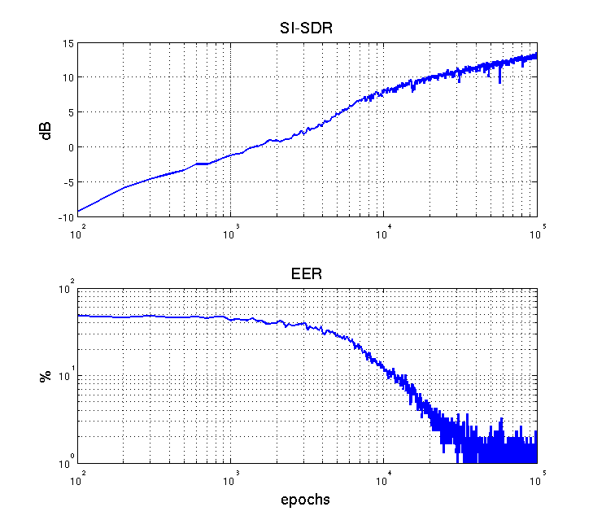

Blind Speech Separation and Dereverberation
=========================


This repository contains python/tensorflow code to reproduce the experiments presented in our paper
[Blind Speech Separation and Dereverberation using Neural Beamforming](https://doi.org/10.1109/ICASSP.2019.8683517).


Requirements
------------

The data loader uses the 'pyroomacoustics' package to generate artifical RIRs.
Install with:
```
pip install pyroomacoustics
```

And the 'soundfile' package to read/write wavs:
```
pip install soundfile
```


To add your speech database, edit the 'path' keys in the configuration file:
```
nano -w experiments/shoebox_c2.json
```

You can also set the number of speakers, and the FFT length/shift for the frequency domain variant (BSSD-FD)


Preriquisites
-------------

Prior to training, a set of RIRs and DOA bases is required. Both sets will be stored as .mat containers in the 'data/' folder.


To generate a set of 720 artifical RIRs, use:
```
cd loaders
python rir_loader.py
```


To generate a set of 100 DOA bases, use:
```
cd loaders
python doa bases.py
```


Training
--------

To train the frequency domain model (BSSD-FD), use:
```
cd experiments
python bssd_combined_fd.py
```

To train the time domain (BSSD-TD), use:
```
cd experiments
python bssd_combined_td.py
```

Due to the custom complex-valued layers, training for the FD takes roughly 8 times as long as for the TD model.


Validation
----------

To validate the models, use:
```
cd experiments
python bssd_combined_td.py valid
```

This will generate a single prediction, plotting the SI-SDR and EER scores.
Also, a matlab container containing the enhanced wavs will be written in the 'predictions/' folder.

To generate a spectrogram plot showing the mixture, and the separated and dereverberated estimates, use:
```
cd experiments
python bssd_combined_td.py plot
```


Performance
-----------

Mixture with 2 speakers, separated and dereverberated using the 'bssd_combined_td' model


SI-SDR and EER after 10^5 training epochs of the 'bssd_combined_td' model


False Accaptance and Rejection Rates for the 101 WSJ0 speakers of the 'bssd_combined_td' model


Citation
--------

Please cite our work as 

```
@misc{pfeifenberger2021blind,
      title={Blind Speech Separation and Dereverberation using Neural Beamforming}, 
      author={Lukas Pfeifenberger and Franz Pernkopf},
      year={2021},
      eprint={2103.13443},
      archivePrefix={arXiv},
      primaryClass={cs.SD}
}
```


